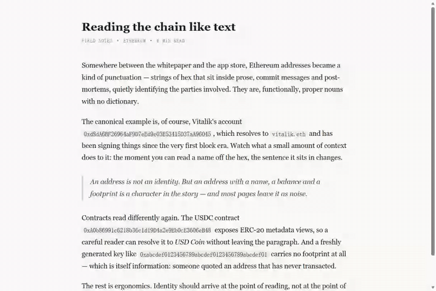
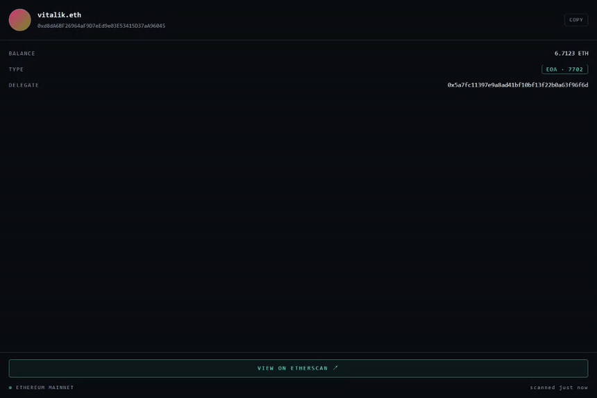

# 0x Lens

English | [简体中文](README.zh-CN.md)

[](https://github.com/Sophran-fbj/0x-lens/actions/workflows/ci.yml)

> Hover any Ethereum address or ENS name on the web to reveal its onchain identity.

Chrome extension · Manifest V3 · Ethereum mainnet.

## At a glance

| | |
|---|---|
| **Problem** | Ethereum identities appear everywhere, but checking each one means leaving the page and opening an explorer. |
| **What I built** | A Chrome extension that turns addresses and ENS names into hoverable identity cards with a persistent side-panel view. |
| **Tech stack** | React · TypeScript · WXT · viem · Chrome MV3 · Framer Motion |
| **Demo / install** | See the demos below; build locally with `npm run build`, or download a packaged ZIP from a tagged GitHub Release. |

**52 browser E2E checks + 10 RPC checks · zero host-page DOM mutation · no telemetry · single-origin RPC architecture**

Three technical highlights:

- A `Range.getClientRects()` overlay annotates text without modifying the host DOM.
- All chain access stays in the MV3 service worker, with CCIP-Read disabled and non-RPC fetches blocked.
- An idle-chunked, mutation-aware scanner handles SPA churn, node moves, layout shifts, and ENS/address edge cases.



An address appears in an article, a post-mortem, a commit thread. You hover
it: it lights up, a scan line sweeps across it — *the scan is the loading
state* — and an identity card unfolds: ENS, ETH balance, EOA / contract /
token, and (since Pectra) EIP-7702 delegation. Click to open the Side Panel
for the full readout.

Both directions of chain identity are readable: hex addresses (including
truncated `0x1234…abcd` display forms, recovered from their link href) and
ENS names (`vitalik.eth` in prose resolves forward to the account).



## Principles

- **No wallet, no onboarding, no accounts.** Install and browse.
- **No third-party APIs, no backend, no telemetry.** Ethereum JSON-RPC is the
  only data source; nothing ever leaves the browser except onchain identity
  lookups to your RPC endpoint — enforced mechanically: CCIP-Read is disabled (offchain
  ENS resolvers cannot redirect lookups to their own gateways) and the service
  worker's `fetch` rejects any non-RPC origin. No page content is transmitted,
  and error messages crossing into page-rendered UI are stable codes, never
  raw RPC errors (which can embed endpoint URLs and keys).
- **The host page is never modified.** Highlights are computed from
  `Range.getClientRects()` and painted in an isolated Shadow DOM overlay —
  React/Vue reconciliation on the page can never see us.
- **It's a lens, not an explorer.** Etherscan is one click away for anything
  deeper.

## What it reads

| | |
|---|---|
| ENS | reverse resolution for addresses and forward resolution for `.eth` names (pure RPC via the universal resolver) |
| Balance | `eth_getBalance`, formatted without float math |
| Account type | bytecode: none → **EOA**; `0xef0100‖addr` → **EOA with EIP-7702 delegation** (still an EOA, delegate shown); else **CONTRACT** |
| Token metadata | contracts probed once via Multicall3 (`name`/`symbol`/`decimals`); renders as `TOKEN · USDC`, never claims verified ERC-20 compliance |
| Empty state | zero-balance, nameless, contractless → *NO ON-CHAIN FOOTPRINT* |

Detection: `/\b0x[a-fA-F0-9]{40}\b/g` with EIP-55 checksum enforcement for
mixed-case strings (all-lower/upper accepted). Truncated display forms
(`0x1234…abcd`) are recovered from their nearest link's `href` — the recovered
address must pass checksum AND match the visible prefix/suffix. ENS names
(ASCII labels + `.eth`, email domains excluded) resolve forward via the
universal resolver; unregistered names show a dedicated empty state. Known
honest misses: truncated text outside links, old tokens whose `name()`
returns `bytes32` (MKR → plain CONTRACT), and names on offchain CCIP-Read
resolvers (disabled for the single-origin privacy guarantee).

## Measured numbers

Scanning (real pages, initial scan, idle-chunked off the critical path —
median/range over several runs; wall-clock includes idle-scheduling waits
while the page itself loads, main-thread work per chunk is capped at 8 ms):

| Page | Text nodes | Highlights | Scan wall-time |
|---|---|---|---|
| Test rig (175 identities incl. stress) | ~220 | 175 | ~600 ms (stable) |
| etherscan.io token page | ~2100 | 1 truncated row recovered via href (visible addresses are truncated; full ones live in `<script>` payloads, deliberately never scanned) | 20–90 ms typical, ~1 s on a busy load |
| Wikipedia · Ethereum | 1977 | 0 | 20–170 ms |

Hover → data: first hover ≈ 1.7–2.3 s end-to-end (includes the 550 ms
acquire animation + one RPC round trip to a public endpoint); re-hover of a
scanned address ≈ **0.22–0.27 s** from cache, skipping the scan ceremony.

## Architecture

```
Content Script (top frame)             Background SW               Side Panel
  scanner: TreeWalker + regex    ───▶  viem publicClient      ◀──  React page
  + EIP-55 validation                   batch:true (identity      storage.watch
  overlay: Range rects →                = one JSON-RPC batch)      on session:lens:focus
  Shadow DOM, zero DOM mutation         storage.session cache
  hover card: Shadow DOM +              (balance TTL 60s,
  Framer Motion                          identity session-permanent)
```

Engineering notes worth reading (all verified by e2e, not aspiration):

- **Zero-mutation annotation** — page-absolute overlay coordinates mean
  scrolling needs no listeners; MutationObserver (debounced batches) +
  WeakSet dedup + a 500-match cap handle SPA churn and explorer tables.
- **Two-wave data pipeline** — `Promise.all(balance, bytecode, ensName)` then,
  for contracts, a token-metadata multicall. The card's reveal choreography
  maps 1:1 onto the real fetch stages; the scan line's duration is tuned to
  RPC latency so the animation *is* the loading state.
- **MV3 service-worker reality** — the SW dies constantly; all state lives in
  `chrome.storage.session`, messages are idempotent, and concurrent lookups
  coalesce in-flight.
- **The side-panel gesture path** — `sidePanel.open()` is the first statement
  of its message branch (no awaits before it); the user-gesture window
  through message passing is ~1 ms in the worst reported cases.

## Permissions

`storage`, `sidePanel`, plus exactly one host permission: your RPC endpoint's
origin (derived from `VITE_RPC_URL`, or viem's default). Content-script
injection uses `matches`; no `tabs`, no `scripting`, no remote code.

## Dev

Requires Node 20+ and a Chromium-family browser (e2e uses the system Edge
channel).

```sh
npm install
npm run fixture        # test rig + article page on localhost:5173
npm run dev            # WXT dev (note: HMR breaks on strict-CSP sites — iterate on the fixture)
npm run build          # production build → .output/chrome-mv3 (load unpacked)
```

Test suite (needs the fixture server + a fresh build):

```sh
node e2e/verify.mjs    # detection layer: 31/31
node e2e/rpc.mjs       # data pipeline against real mainnet: 10/10
node e2e/card.mjs      # hover card over the real message path: 11/11
node e2e/panel.mjs     # side panel + gesture open path: 10/10
node e2e/perf.mjs      # real-site scan measurements
node e2e/demo.mjs && node e2e/convert.mjs   # regenerate docs/*.gif
```

### CI and RPC-dependent tests

GitHub Actions runs these checks on every push and pull request:

- `npm run compile`
- `npm run build`
- `node e2e/verify.mjs` against the local fixture — 31 offline browser checks with no Ethereum RPC access.

The remaining suites intentionally access Ethereum mainnet:

- `node e2e/rpc.mjs` — 10 direct RPC pipeline checks.
- `node e2e/card.mjs` — 11 browser checks over the real content-script → service-worker → RPC path.
- `node e2e/panel.mjs` — 10 browser checks including RPC and the side-panel gesture path.

`VITE_RPC_URL` is optional; without it, viem's public mainnet endpoint is used. Set your own endpoint for stable local or private-CI runs. Never commit the value — `.env` is ignored.

Tip: persistent browser profiles cache old service workers — delete
`.playwright-profile` when background changes seem to not apply.

## Releases

Pushing a version tag runs offline CI, packages the extension with WXT, and publishes the Chrome ZIP as a GitHub Release. Update `manifest.version` in `wxt.config.ts` before tagging:

```sh
git tag v0.1.0
git push origin v0.1.0
```

Chrome Web Store publishing remains manual because it requires a developer account and store review.

## Roadmap (V2 ideas, deliberately not built)

Multi-chain (Base/Arbitrum) · viewport-bounded prefetch · USD pricing ·
per-site enablement UX · keyboard access for highlights · unicode/emoji ENS
names (ENSIP-15 normalization).

## License

MIT
